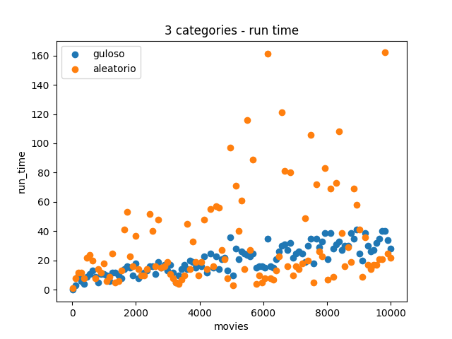
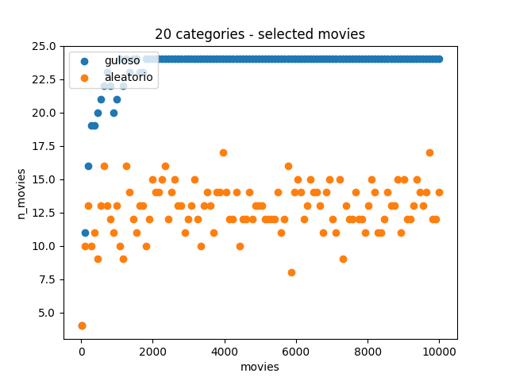

# Relatório Parcial

## Heurísticas

* `guloso`
* `aleatório`

## Implementação

### Arquivos em comum (dir: `helpers`)

#### Funções

```cpp
void read_movies_data(std::vector<movie> &movies, int n_mov);
void read_cats_limit(std::map<int, int> &lim_cats, int n_cat);
void include_movie(movie &curr_movie, std::vector<movie> &movies, int &times_filed);
void set_cats_limit(std::map<int, int> &lim_cats, int mov_cat, int &cats_limit);
void print_agenda(std::vector<movie> selected);
```

*Input handle:*

* `read_movies_data`: lê os dados dos filmes do arquivo de input.
* `read_cats_limit`: lê o limite de filmes por categoria do arquivo de input.

*Run time:*

* `include_movie`: inclui um filme na agenda e incrementa um contador de horários preenchidos (`times_filed`).
* `set_cats_limit`: decrementa o limite de filmes por categoria. Caso o limite de certa categoria seja atingido, é decrementado o número de categorias que ainda podem ser preenchidas (`cats_limit`).
  
*Output handle:*

* `print_agenda`: imprime a agenda de filmes selecionados - funcão para verificacão visual.

#### Otimizações
* Caso já tenha extinguido todos os filmes de todas as categorias, a funcão para (`cats_limit` ser 0).
* Caso já tenha preenchido 24hrs, a função para (`times_filed` ser 24).
  * obs: se o filme passa das 24hrs, ele não incrementa times_filed, a ideia é liberar assistir na madrugada e apenas parar quando o dia todo foi preenchido.

#### Overview

Em todas as implementacoes, a função `main` é responsável por ler os dados de input, ordenar os filmes por horário de término (a implementacão guloso selecionada) e chamar a função `select_movies` que é responsável por selecionar os filmes. A função `main` também é responsável por imprimir o tempo de execução do algoritmo.

Detalhes:

* Filmes que acabam e terminam no mesmo horário são tratados igual filmes que tem 2 horas (comecam em t e acabam em t+1)
* É permitido comecar a ver um filme antes da meia noite, e virar a madrugada

### Guloso

#### Funcao de selecão de filmes
```cpp
int select_movies(std::vector<movie> &movies, std::vector<movie> &selected, std::map<int, int> &lim_cats, int n_cat);
```

argumentos:

* `movies`: vetor de filmes a serem selecionados.
* `selected`: vetor de filmes selecionados.
* `lim_cats`: mapa de limites de filmes por categoria.
* `n_cat`: número de categorias - utilizado para otimizacão, cada vez que uma categoria é preenchida (limite atingido), esse contador é subtraído, se o mesmo chega em zero (todas categorias atingiram o limite) o código para.
* `retorno`: tempo de tela total dos filmes selecionados.
  
A lógica da escolha é feita da seguinte forma:

* Para cada filme, verifica se o horário de término é maior que o horário de término do filme anterior.
  *  Caso seja maior:
    * Atualiza o horário de término dos filmes (para ser igual o do filme na iteracão) - isso significa que certo horário não tem nenhum filme, ou todos filmes do horário já foram considerados.
    * Verifica se algum novo filme foi selecionado (desde a última inclusão)
    * Caso foi, adiciona o filme selecionado na agenda.
  * Continua a iteração.
    * Compara se o filme atual cabe na agenda (checando horários e filmes por categoria).
    * Compara o inicio do filme, com o início do antigo filme selecionado - dos filmes que terminam neste horário, qual comeca mais cedo?.
    * Caso o filme atual seja mais cedo, substitui o antigo filme selecionado.

#### Valgrind

```bash
-- line 2 ----------------------------------------
    .  #include <cassert>
    .  #include <chrono>
    .  using namespace std;
    .  
    .  bool hasSlot(movie curr, movie prev) {
    .    return curr.start >= prev.end;
    .  }
    .  
   13  void select_movies(vector<movie> &movies, vector<movie> &selected, map<int, int> &lim_cats, int n_cat) {
    1    int time_end = 0;
    1    int min_time = 100;
    1    bool has_selected = false;
    1    int times_filed = 0;
    1    movie last_selected = {0, 0, 0, 0};
    .    movie selected_movie;
2,976    for(auto& mov: movies) {
    .      
3,000      if(n_cat <= 0) return;
2,000      if(times_filed > 24) return;
    .  
3,000      if(mov.end > time_end) {
    .        time_end = mov.end;
    .  
   84        if (has_selected) {
   23          min_time = 100;
   96          include_movie(selected_movie, selected, times_filed);
3,668  => /home/user/supercomp/project/helpers/helpers.cpp:include_movie(movie&, std::vector<movie, std::allocator<movie> >&, int&) (23x)
   92          set_cats_limit(lim_cats, selected_movie.cat, n_cat);
1,691  => /home/user/supercomp/project/helpers/helpers.cpp:set_cats_limit(std::map<int, int, std::less<int>, std::allocator<std::pair<int const, int> > >&, int, int&) (23x)
   46          last_selected = selected_movie;
   46          has_selected = false;
    .        };
    .      }
7,034      if(mov.start < min_time && lim_cats[mov.cat] > 0 && hasSlot(mov, last_selected))  {
   78        selected_movie = mov;
   26        min_time = mov.start;
   26        has_selected = true;
    .      }
    .    }
   11  }
    .  
   12  int main(int argc, char *argv[]) {
    .    int n_mov, n_cat;
    .  
    .    map<int, int> lim_cats;
    .    vector<movie> movies, selected;
    .  
    7    cin >> n_mov >> n_cat;
8,358  => ???:0x0000000000109200 (2x)
    .  
    1    movies.reserve(n_mov);
    .  
    4    set_cats_limit(lim_cats, n_cat);
9,254  => /home/user/supercomp/project/helpers/helpers.cpp:set_cats_limit(std::map<int, int, std::less<int>, std::allocator<std::pair<int const, int> > >&, int) (1x)
    .  
    4    read_movies_data(movies, n_mov);
3,294,712  => /home/user/supercomp/project/helpers/helpers.cpp:read_movies_data(std::vector<movie, std::allocator<movie> >&, int) (1x)
    .  
    .    sort(movies.begin(), movies.end(), [](auto& i, auto& j){return i.end < j.end;});
    .  
    2    chrono::steady_clock::time_point begin = chrono::steady_clock::now();
  950  => ???:0x00000000001092d0 (1x)
    .  
    5    select_movies(movies, selected, lim_cats, n_cat);
50,528  => guloso.cpp:select_movies(std::vector<movie, std::allocator<movie> >&, std::vector<movie, std::allocator<movie> >&, std::map<int, int, std::less<int>, std::allocator<std::pair<int const, int> > >&, int) (1x)
    .  
    1    chrono::steady_clock::time_point end = chrono::steady_clock::now();
   40  => ???:0x00000000001092d0 (1x)
    .  
    .    cout << chrono::duration_cast<chrono::microseconds>(end - begin).count();
    .  
    2    if(argc > 1) return 0;
    .  
    .    cout << endl;
    .  
    2    print_agenda(selected);
250,112  => /home/user/supercomp/project/helpers/helpers.cpp:print_agenda(std::vector<movie, std::allocator<movie> >) (1x)
    .  
    1    return 0;
    .  
   15  }
```

Como pode-se observar na análise do valgrind, as únicas funcões que tem pior desempenho são as de leitura dos inputs, e as de print da agenda - contudo as mesmas são chamadas apenas uma vez. As outras funcões são chamadas muitas vezes, mas não consomem tanto tempo, e a maior parte do tempo é gasto em comparações e atribuições.

### Aleatório
#### Funcao de selecão de filmes
```cpp
int select_movies(vector<movie> &movies, vector<movie> &selected, map<int, int> &lim_cats, 
map<int, bool> &filled_slots, int n_cat, int n_mov);
```

argumentos:

* `movies`: vetor de filmes a serem selecionados.
* `selected`: vetor de filmes selecionados.
* `lim_cats`: mapa de limites de filmes por categoria.
* `filled_slots`: mapa de slots preenchidos - cada vez que um filme é adicionado, ele preenche seus horários no mapa.
* `n_cat`: número de categorias - utilizado para otimizacão, cada vez que uma categoria é preenchida (limite atingido), esse contador é subtraído, se o mesmo chega em zero (todas categorias atingiram o limite) o código para.
* `n_mov`: número de filmes lido
* `retorno`: tempo de tela total dos filmes selecionados.
  
A lógica da escolha é feita da seguinte forma:

* Implementa a mesma lógica descrita na gulosa
* Dentro do loop principal, checa se um filme aleatório pode ser adiconado - com 25% de chance
  * Caso positivo:
    * Checa o limite de categorias e se o slot está disponível (cabe no horário)
    * Caso o filme seja adicionado, é realizado um check para ver se o filme selecionado pela gulosa ainda cabe (categoria e slot)

#### Valgrind
```bash
-- line 3 ----------------------------------------
    .  #include <random>
    .  #include <chrono>
    .  
    .  #define SEED 42
    .  #define PROB 0.75
    .  
    .  using namespace std;
    .  
2,618  bool hasSlot(movie curr, map<int, bool> &filled_slots) {
  724    if(curr.end == curr.start) return !filled_slots[curr.start];
1,164    for(int i = curr.start; i < curr.end; i++) {
  976      if(filled_slots[i]) return false;
    .    }
   14    return true;
1,904  }
    .  
  121  void fill_slot(map<int, bool> &filled_slots, movie curr) {
   33    if(curr.end == curr.start) {
    1      filled_slots[curr.start] = true;
    1      return;
    .    }
  136    for(int i = curr.start; i < curr.end; i++) {
   24      filled_slots[i] = true;
    .    }
   88  }
    .  
   17  void select_movies(vector<movie> &movies, vector<movie> &selected, map<int, int> &lim_cats, map<int, bool> &filled_slots, int n_cat, int n_mov) {
    .    uniform_real_distribution<double> distribution(0.0, 1.0);
    .    default_random_engine generator;
    3    generator.seed(SEED + time(0));
    8  => ???:0x0000000000109260 (1x)
    .  
    2    int time_end = 0;
    1    int min_time = 100;
    1    int times_filed = 0;
    1    bool has_selected = false;
    .  
    .    //movie last_selected = {0, 0, 0, 0};
    .    movie selected_movie;
  844    for(int i = 0; i < n_mov; i++) {
  848      if(n_cat <= 0) return;
  424      if(times_filed > 24) return;
  844      if(movies[i].end > time_end) {
    .        time_end = movies[i].end;
    .  
   24        if (has_selected) {
   15          include_movie(selected_movie, selected, times_filed);
  344  => /home/user/supercomp/project/helpers/helpers.cpp:include_movie(movie&, std::vector<movie, std::allocator<movie> >&, int&) (3x)
   12          set_cats_limit(lim_cats, selected_movie.cat, n_cat);
  220  => /home/user/supercomp/project/helpers/helpers.cpp:set_cats_limit(std::map<int, int, std::less<int>, std::allocator<std::pair<int const, int> > >&, int, int&) (3x)
   12          fill_slot(filled_slots, selected_movie);
  182  => aleatorio.cpp:fill_slot(std::map<int, bool, std::less<int>, std::allocator<std::pair<int const, bool> > >&, movie) (3x)
    .  
    9          min_time = 100;
    6          has_selected = false;
    .        };
    .      }
  422      if(distribution(generator) > PROB) {
   48        uniform_int_distribution<int> distribution(i, movies.size()-1);
    .        int p = distribution(generator);
  561        if(hasSlot(movies[p], filled_slots) && lim_cats[movies[p].cat] > 0) {
12,009  => aleatorio.cpp:hasSlot(movie, std::map<int, bool, std::less<int>, std::allocator<std::pair<int const, bool> > >&) (48x)
   24          include_movie(movies[p], selected, times_filed);
2,601  => /home/user/supercomp/project/helpers/helpers.cpp:include_movie(movie&, std::vector<movie, std::allocator<movie> >&, int&) (8x)
   48          set_cats_limit(lim_cats, movies[p].cat, n_cat);
  549  => /home/user/supercomp/project/helpers/helpers.cpp:set_cats_limit(std::map<int, int, std::less<int>, std::allocator<std::pair<int const, int> > >&, int, int&) (8x)
   48          fill_slot(filled_slots, movies[p]);
1,064  => aleatorio.cpp:fill_slot(std::map<int, bool, std::less<int>, std::allocator<std::pair<int const, bool> > >&, movie) (8x)
    .          
   48          if(!(hasSlot(selected_movie, filled_slots) && lim_cats[selected_movie.cat] > 0)) {
  460  => aleatorio.cpp:hasSlot(movie, std::map<int, bool, std::less<int>, std::allocator<std::pair<int const, bool> > >&) (8x)
   16            min_time = 100;
   16            has_selected = false;
    .          }
    .        }
    .      }
2,534      if(movies[i].start < min_time && lim_cats[movies[i].cat] > 0 && hasSlot(movies[i], filled_slots))  {
11,881  => aleatorio.cpp:hasSlot(movie, std::map<int, bool, std::less<int>, std::allocator<std::pair<int const, bool> > >&) (182x)
    8        selected_movie = movies[i];
    8        min_time = movies[i].start;
    8        has_selected = true;
    .      }
    .    }
   11  }
    .  
   12  int main(int argc, char *argv[]) {
    .    int n_mov, n_cat;
    .    // int id, n, w, weigth, val;
    .  
    .    map<int, bool> filled_slots;
    .    map<int, int> lim_cats;
    .    vector<movie> movies, selected;
    .  
    8    cin >> n_mov >> n_cat;
8,358  => ???:0x0000000000109210 (2x)
    .  
    1    movies.reserve(n_mov);
    .  
    5    set_cats_limit(lim_cats, n_cat);
9,254  => /home/user/supercomp/project/helpers/helpers.cpp:set_cats_limit(std::map<int, int, std::less<int>, std::allocator<std::pair<int const, int> > >&, int) (1x)
    .  
    5    read_movies_data(movies, n_mov);
3,294,712  => /home/user/supercomp/project/helpers/helpers.cpp:read_movies_data(std::vector<movie, std::allocator<movie> >&, int) (1x)
    .  
    .    sort(movies.begin(), movies.end(), [](auto& i, auto& j){return i.end < j.end;});
    .  
    2    chrono::steady_clock::time_point begin = chrono::steady_clock::now();
  950  => ???:0x00000000001092f0 (1x)
    .  
    8    select_movies(movies, selected, lim_cats, filled_slots, n_cat, n_mov);
55,592  => aleatorio.cpp:select_movies(std::vector<movie, std::allocator<movie> >&, std::vector<movie, std::allocator<movie> >&, std::map<int, int, std::less<int>, std::allocator<std::pair<int const, int> > >&, std::map<int, bool, std::less<int>, std::allocator<std::pair<int const, bool> > >&, int, int) (1x)
    .  
    1    chrono::steady_clock::time_point end = chrono::steady_clock::now();
   40  => ???:0x00000000001092f0 (1x)
    .  
    .    cout << chrono::duration_cast<chrono::microseconds>(end - begin).count();
    .  
    2    if(argc > 1) return 0;
    .  
    .    cout << endl;
    .  
    .    sort(selected.begin(), selected.end(), [](auto& i, auto& j){return i.start < j.start;});
    .  
    2    print_agenda(selected);
134,776  => /home/user/supercomp/project/helpers/helpers.cpp:print_agenda(std::vector<movie, std::allocator<movie> >) (1x)
    .  
   15  }

--------------------------------------------------------------------------------
```
Como pode-se observar na análise do valgrind, as únicas funcões que consomem mais tempo são as de leitura dos inputs, e as de print da agenda - contudo as mesmas são chamadas apenas uma vez. As outras funcões são chamadas muitas vezes, mas não consomem tanto tempo, e a maior parte do tempo é gasto em comparações e atribuições. Se comparado ao guloso, a funcão `select_movies` do aleatório tem desempenho pior, pois a lógica de validacão para incluir um filme é mais complexa - usa um dicionário, equanto na gulosa, como é sequencial, apenas compara com o filme anterior.

## Resultados

### Overview (Gráficos 3D)

Para o aleatório, cada entrada foi rodada 10 vezes (para ver diferenca entre os outputs) já para o guloso, apenas uma (output determinístico).

Assim no gráfico do aleatório foram plotadas 2 superfícies (considerando as 10 iteracoes):

* O mínimo atingido - curva vermelha
* E o máximo - curva azul

#### Tempo de execucão

**Guloso**            |  **Aleatório**
:-------------------------:|:-------------------------:
  |  

Podemos ver que o tempo de execucão do guloso claramente aumenta conforme tem mais categorias e mais filmes. Uma maior quantidade de filmes o faz aumentar pois ele vai recusar uma grande quantidade de filmes inválidos (vai checando os do mesmo horário até achar o que comeca mais cedo). Um maior numero de categorias faz com que seja muito dificil do limite ser atingido (vai ter mais categoria que filmes selecionados), portanto a parte que para o código caso nenhuma categoria tenha mais espaco, nunca é ativada.

No gráfico do aleatório, se comparado ao guloso temos as seguintes situacões

* No geral parece ser parecido
* A curva máxima é mais demorada em alguns casos
* A curva minima aparenta ser quase sempre - principalmente em casos com muitos filmes

**curva máxima**

Como o loop principal da aleatório (gerar valores aleatorios, ver se cabe, a agenda é um dicionário) é mais complexo que o da gulosa (apenas verifica se o filme comeca depois que o anterior termina), caso eles tivessem a mesma quantidade de iteracões, é de se esperar que o aleatório demore mais.

Dito isso, o motivo da demora a mais deve se dar o fato de que várias solucões aleatórias fossem escolhidas (p < 25), mas poucas tivessem espaco para serem incluidas. Assim o algorítimo deve ter iteracões similares ao do guloso, mas com verificacões mais demoradas.

**curva minima**

Se as verificacões do aleatório são mais complexas, como ele é mais rápido?

Simples, ambos os códigos tem otimizacões que param quando as 24hrs do dia enchem. O aleatório, nesses casos mais rápidos, faz a inclusão de filmes mais longos que ocupam mais a agenda. Dessa forma, enquanto o guloso está recusando vários filmes que não cabem, o aleatório, além de fazer isso, inclui filmes no meio/no final da agenda para enchê-la.


#### Tempo de tela

**Guloso**            |  **Aleatório**
:-------------------------:|:-------------------------:
  |  


Com esses dois gráficos, não se pode concluir muito. Os resultados mais aparentes são que:

* Ambos chegam a um tempo de 24hrs (ou perto), quando se atinge mais ou menos 10 categorias
    * quando há poucos filmes, parece variar mais.
* O aleatório varia em torno de 24hrs - isso se dá pois ele consegue colocar filmes mais longos que viram na madrugada
* O guloso **para** em 24 conforme a quantidade de filmes aumenta (diminui a chance de sobrar um slot para virar a madrugada, quando se atinge os filmes finais)

Vamos analizar mais a fundo na sessão 2D, para ver o comportamento com uma menor quantidade de filmes e categorias.
#### Quantidade de filmes selecionados

**Guloso**            |  **Aleatório**
:-------------------------:|:-------------------------:
  |  

Ao observar o gráfico do guloso, pode-se concluir que em torno de 10 categorias, ele passa a sempre (ou quase sempre), ter 24 filmes - isso porque fica quase impossível atingir o limite de categoria, portanto sempre terá um filme para ser encaixado no slot. Como os filmes são percorridos em ordem de término crescente, com uma grande quantidade de filme é certo que terá algum filme de duracão 1 que possa ser incluido.

Por outro lado o guloso varia em torno de 12. Isso pois ele pode, ao acaso, escolher algum filme longo (e na maioria das vezes vai) que ocupa mais tempo na agenda.

Como no caso anterior, será feita uma análise mais completa nos gráficos 2D.

### Aprofundando (Gráficos 2D)

#### Tempo de execucão

**1 category**            |  **2 categories**           |  **3 categories**
:-------------------------:|:-------------------------: |:-------------------------:
  |    |  
**5 categories**            |  **10 categories**          |  **20 categories**
  |   |  

Os gráficos com categoria fixadas mostram como o comportamento do aleatório muda bastante - realmente depende se os filmes escolhidos podem ser incluidos ou não.

Com categorias fixadas é dificil escolher um vencedor. Vamos declarar um empate, pois, mesmo que o aleatório ganhe em varias vezes, perde em algumas.

**10 movies** | **100 movies**
:-------------------------:|:-------------------------:
 | 
**1000 movies** | **10000 movies**
 | 

Com esses gráficos de filmes fixados fica claro que com poucos filmes o guloso leva vantagem - isso porque ele não verifica tantos filmes inválidos, e com menos iteracões, a chance de filmes ocuparem a agenda toda é menor.

Contudo com muitos filmes, o aleatório claramente é superior - motivo já explicado.

#### Tempo de tela

**1 category**            |  **2 categories**           |  **3 categories**
:-------------------------:|:-------------------------: |:-------------------------:
  |    |  
**5 categories**            |  **10 categories**          |  **20 categories**
  |   |  

Observando os gráficos com categorias fixadas, pode-se tomar as seguintes conclusões:

* De fato, ao chegar em 10 categorias, o guloso não passa de 24hrs de tempo de tela
* Independentemente do número de categorias, o tempo de tela do aleatório é maior. Isso se da pelo fato de ter mais chances de escolher filmes longos do que o guloso. O guloso tende a encher as 24 horas com filmes curtos, enquanto no aleatório, a escolha de filmes que viram a madrugada (ainda mais quando são longos) traz uma vantagem enorme.

**10 movies** | **100 movies**
:-------------------------:|:-------------------------:
 | 
**1000 movies** | **10000 movies**
 | 

Observando os gráficos com filmes fixados, pode-se tomar as seguintes conclusões:

* Com poucos filmes, o desempenho das duas heurísticas é parecido - pode-se até argumentar que o guloso é melhor, pois o aleatório é menos consistente.
* Com muitos filmes, o aleatório é melhor - justamente pelo motivo, já explicado, dos filmes que viram a madrugada

#### Quantidade de filmes selecionados

**1 category**            |  **2 categories**           |  **3 categories**
:-------------------------:|:-------------------------: |:-------------------------:
  |    |  
**5 categories**            |  **10 categories**          |  **20 categories**
  |   |  

Observando os gráficos com categorias fixadas, pode-se tomar as seguintes conclusões:

* com uma ou duas, o número de filmes é igual (ou praticamente igual)
* A partir de 3 categorias o guloso comeca a selecionar mais filmes
* Com muitas categorias, quando se tem mais de 1000 filmes, o guloso sempre seleciona mais, fica fixado em 24 filmes.

**10 movies** | **100 movies**
:-------------------------:|:-------------------------:
 | 
**1000 movies** | **10000 movies**
 | 

Observando os gráficos com filmes fixados, pode-se tomar as seguintes conclusões:

* Logo de cara - 100 filmes - o guloso já comeca a se destacar, ou seja, seleciona mais filmes
* Com uma quantidade muito grande, as categorias não influenciam muito, o guloso fixa em 24 filmes

## Conclusão

O aleatório traz uma funcionalidade que o guloso não tem: exploration. O mesmo consegue sair do estado atual e gerar novos valores sem relacão a tal estado. Por esse motivo o mesmo ganha um destaque em tempo de tela, a maior chance de selecionar filmes mais longos, ainda mais quando viram a madrugada, é um game-changer. Por fazer tais escolhas de filmes longos, o seu run-time também tende a ser menor. 

Contudo, quando se opta por filmes mais longos, uma métrica é sacrificada: a quantidade de filmes. Nesta métrica, por tender a sempre escolher filmes que caibam nos menores slots, ou seja, filmes curtos, o guloso leva uma grande vantagem.